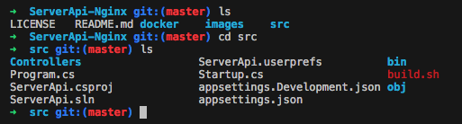
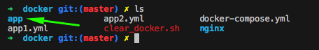
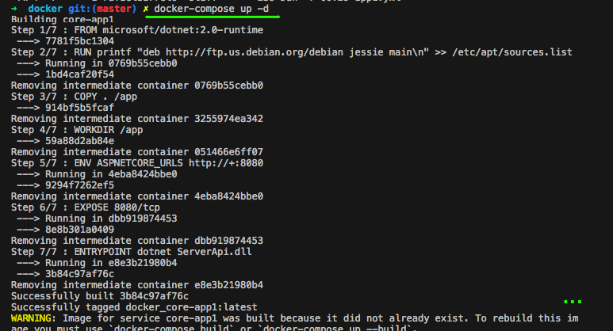
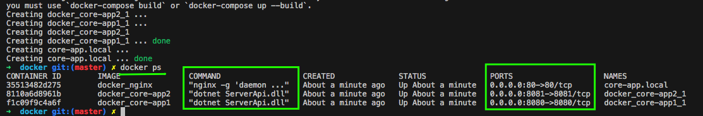
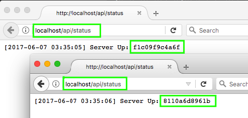

# ServerApi-Nginx
Dotnet core api with docker compose and scripts to run on nginx
----

Steps to build and run:

1 - Enter in "src" folder



2 - Run the script "build.sh"
```
$ ./build.sh
```

3 - Enter in "/docker" folder
```
$ cd ../docker
```

3 - Verify that "app" folder was created



4 - Run the command
```
$ docker-compose up -d
```


5 - See the containers



5 - Access your browser and navigate to http://localhost/api/status



Look you are accessing by port 80 (nginx) but your request is directed to each container app.

If you want to clean all containers, run __"clean_docker.sh"__
